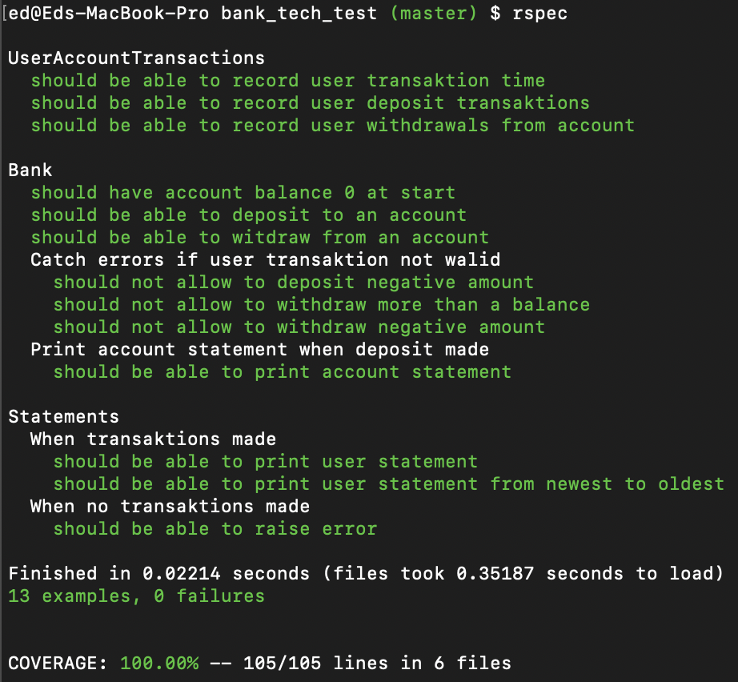

# Bank tech test

[Project Description](#project-description) | [Installation](#getting-started) | [Running tests](#running-tests) | [User Stories](#user-stories) | [Models](#domain-models) | [Further development](#further-development)

## Project Description

- Producing the best code you can when there is a minimal time pressure.
- Practice your OO design and TDD skills.
- Work alone, and you'll also review your own code so you can practice reflecting on and improving your own work.

## Specification

### Requirements

- You should be able to interact with your code via a REPL like IRB or the JavaScript console. (You don't need to implement a command line interface that takes input from STDIN.)
- Deposits, withdrawal.
- Account statement (date, amount, balance) printing.
- Data can be kept in memory (it doesn't need to be stored to a database or anything).

### Acceptance criteria

**Given** a client makes a deposit of 1000 on 10-01-2012  
**And** a deposit of 2000 on 13-01-2012  
**And** a withdrawal of 500 on 14-01-2012  
**When** she prints her bank statement  
**Then** she would see

```
date || credit || debit || balance
14/01/2012 || || 500.00 || 2500.00
13/01/2012 || 2000.00 || || 3000.00
10/01/2012 || 1000.00 || || 1000.00
```

### User Stories

```
As a User
So I can have a balance
I am able to deposit to my account
```

```
As a User
So I can use my card
Im able to withdraw from my account
```

```
As a User
So I can know how much I spent on purchases
Im able to print out a bank statement
```

```
As a Bank
So we prevent withdrawals bigger than a current balance
We able to raise an error
```

### Domain Models

| Bank                       | UserAccountTransaction | Statements     |
| :------------------------- | :--------------------- | :------------- |
| #deposit_to_account()      | #deposit()             | #print_balance |
| #withdraw_from_account()   | #withdrawal()          |
| #print_account_statement() |                        |

### Getting Started

- Clone this repository
  `$ git clone https://github.com/EdAncerys/bank_tech_test`
- Navigate to local repository
  `$ cd bank_tech_test`
- Install bundler if you don't already have it
  `$ gem bundle install`
- Install all dependencies
  `$ bundle install`

## Running tests

- Navigate to local repository
  `$ cd bank_tech_test`
- In the terminal type the following command:
  `$ rspec`

## RSpec and test coverage

<div align="center">
  
</div>

## Running the program in **irb** environment:

```
irb
ed@Eds-MacBook-Pro bank_tech_test (master) $ irb
2.7.0 :001 > require './lib/bank.rb'
 => true
2.7.0 :002 > bank = Bank.new
2.7.0 :003 > bank.deposit_to_account 200
 => 200
2.7.0 :004 > bank.withdraw_from_account 50
 => 150
2.7.0 :005 > bank.withdraw_from_account 80
 => 70
2.7.0 :006 > bank.print_account_statement
date || credit || debit || balance
21/06/2020 || || £80.00 || £150.00
21/06/2020 || || £50.00 || £200.00
21/06/2020 || £200.00 || || £0.00
 => ["21/06/2020 || || £80.00 || £150.00", "21/06/2020 || || £50.00 || £200.00", "21/06/2020 || £200.00 || || £0.00"]
2.7.0 :007 >
```

## Final Product Functionality

As a User able to perform bank transactions such as a deposit to a bank account, withdraw from a bank account, print bank statements.

All account transactions stored in local storage.

## Further Development

Ideas to improve application

- Add feature to have UI
- Add feature to save bank transactions to local storage or DB
- Add extra features that mimic real bank functionality

### License

The project is available as open source
