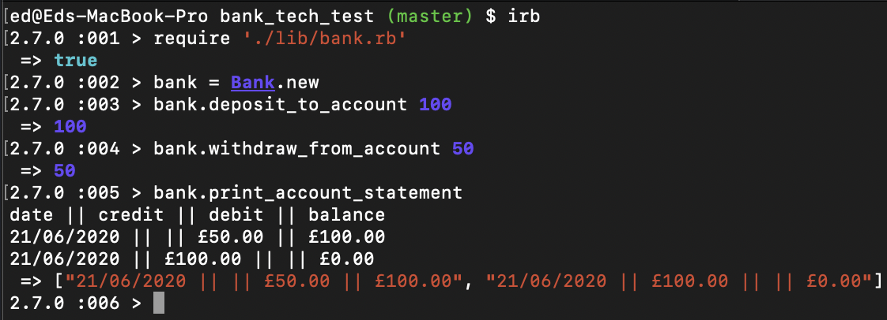

# Bank tech test

## Session goals:

- Producing the best code you can when there is a minimal time pressure.
- Practice your OO design and TDD skills.
- Work alone, and you'll also review your own code so you can practice reflecting on and improving your own work.

## Specification

### Requirements

- You should be able to interact with your code via a REPL like IRB or the JavaScript console. (You don't need to implement a command line interface that takes input from STDIN.)
- Deposits, withdrawal.
- Account statement (date, amount, balance) printing.
- Data can be kept in memory (it doesn't need to be stored to a database or anything).

### Acceptance criteria

**Given** a client makes a deposit of 1000 on 10-01-2012  
**And** a deposit of 2000 on 13-01-2012  
**And** a withdrawal of 500 on 14-01-2012  
**When** she prints her bank statement  
**Then** she would see

```
date || credit || debit || balance
14/01/2012 || || 500.00 || 2500.00
13/01/2012 || 2000.00 || || 3000.00
10/01/2012 || 1000.00 || || 1000.00
```

### User Stories

```
As a User
So I can have a balance
I am able to deposit to my account
```

```
As a User
So I can use my card
Im able to withdraw from my account
```

```
As a User
So I can know how much I spent on purchases
Im able to print out a bank statement
```

```
As a Bank
So we prevent withdrawals bigger than a current balance
We able to raise an error
```

### Domain Models

| Bank                       | UserAccountTransactions | Statements     |
| :------------------------- | :---------------------- | :------------- |
| #deposit_to_account()      | #user_deposits()        | #print_balance |
| #withdraw_from_account()   | #user_withdrawals()     |
| #print_account_statement() |                         |

## Getting Started

To run **Bank_tech_test** you will have to fork this repo and clone to your local machine.

Navigate to repository via command line and follow instructions below:

To install gems dependencies used in a project:

```
bundle
```

To run tests with **RSpec**:

```
rspec
```

To run the program in **irb** environment:

```
irb
ed@Eds-MacBook-Pro bank_tech_test (master) $ irb
2.7.0 :001 > require './lib/bank.rb'
 => true
2.7.0 :002 > bank = Bank.new
2.7.0 :003 > bank.deposit_to_account 100
 => 100
2.7.0 :004 > bank.withdraw_from_account 40
 => 60
2.7.0 :005 > bank.print_account_statement
 => "date || credit || debit || balance, 17/06/2020 || || £40.00 || £100.00\n, 17/06/2020 || £100.00 || || £0.00\n"
2.7.0 :006 >
```

### Final Product Functionality

As a User able to perform bank transactions such as a deposit to a bank account, withdraw from a bank account, print bank statements.

Account transactions stored in local storage.

### RSpec and test coverage

<div align="center">
  
</div>

### User interface preview

<div align="center">
  
</div>

## License

The package is available as open source
